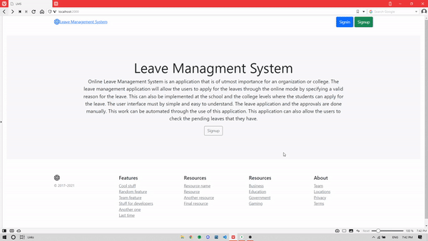
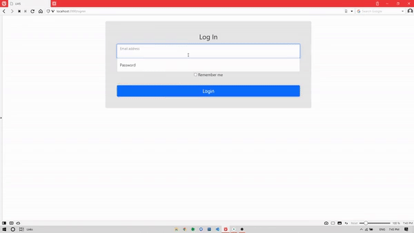
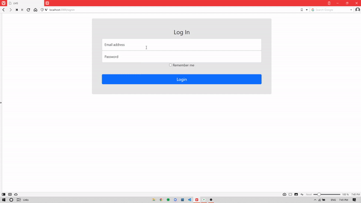

<div id="top"></div>


<!-- PROJECT LOGO -->
<br />
<div align="center">
  <a href="https://github.com/theriteshsharma/LeaveManagmentSystem">
    
  </a>

  <h3 align="center">Leave Managment System</h3>

  <p align="center">
    A Leave Managment System for Enterprises
    <br />
    <a href="https://github.com/theriteshsharma/LeaveManagmentSystem">View Demo</a>
    ·
    <a href="https://github.com/theriteshsharma/LeaveManagmentSystem/issues">Report Bug</a>
    ·
    <a href="https://github.com/theriteshsharma/LeaveManagmentSystem/issues">Request Feature</a>
  </p>
</div>


<!-- TABLE OF CONTENTS -->
<details>
  <summary>Table of Contents</summary>
  <ol>
    <li>
      <a href="#about-the-project">About The Project</a>
      <ul>
        <li><a href="#built-with">Built With</a></li>
      </ul>
    </li>
    <li>
      <a href="#getting-started">Getting Started</a>
      <ul>
        <li><a href="#prerequisites">Prerequisites</a></li>
        <li><a href="#installation">Installation</a></li>
      </ul>
    </li>
    <li><a href="#usage">Usage</a></li>
    <li><a href="#roadmap">Roadmap</a></li>
    <li><a href="#contributing">Contributing</a></li>
    <li><a href="#license">License</a></li>
    <li><a href="#contact">Contact</a></li>
    <li><a href="#acknowledgments">Acknowledgments</a></li>
  </ol>
</details>


<!-- ABOUT THE PROJECT -->
## About The Project

Super Admin



Manager



Employee



Online Leave Management System is an application that is of utmost importance for an organization or college. The leave management application will allow the users to apply for the leaves through the online mode by specifying a valid reason for the leave. This can also be implemented at the school and the college levels where the students can apply for the leave. The user interface must by simple and easy to understand. The leave application and the approvals are done manually. This work can be automated through the use of this application. This application can also allow the users to check the pending leaves that they have.

Existing System:
*	Requesting leave from upper management through written application.
*	Authority checks leave history then grants leave.

Drawbacks:
*	Availability of authority required.
*	Lots of paperwork and time of both the parties is consumed in the process.

Proposed System:
*	Registration for company.
*	Supervisors – Representative of their company on the portal, handler of all the data to the portal.
*	Saving history digitally, requesting leaves from anywhere and easy process than usual.

<p align="right">(<a href="#top">back to top</a>)</p>


### Built With

**Backend** :  

**Frontend** :  EJS Template Engine

**Database** : 

<p align="right">(<a href="#top">back to top</a>)</p>


<!-- GETTING STARTED -->
## Getting Started

### Prerequisites

* npm
  ```sh
  npm install npm@latest -g
  ```

### Installation

1. Clone the repo
   ```sh
   git clone https://github.com/theriteshsharma/LeaveManagmentSystem.git
   ```
2. Install NPM packages
   ```sh
   npm install
   npm start
   ```


<p align="right">(<a href="#top">back to top</a>)</p>


<!-- USAGE EXAMPLES -->
## Usage

1. Visit [http://localhost:2000](http://localhost:2000) 
2. Add a Supervisor and Organization
3. Add Some Managers
4. Managers then can Add Some Users
5. Users will Able to Request Leave
6. Managers Get A calendar View of Leaves


<p align="right">(<a href="#top">back to top</a>)</p>


<!-- ROADMAP -->
## Roadmap

- [x] Add Calendar Api
- [x] Get Events On the Calendar
- [ ] Update UI
- [ ] Add Calender Approval and Rejection

See the [open issues](https://github.com/theriteshsharma/Best-README-Template/issues) for a full list of proposed features (and known issues).

<p align="right">(<a href="#top">back to top</a>)</p>


<!-- CONTRIBUTING -->
## Contributing

If you have a suggestion that would make this better, please fork the repo and create a pull request. You can also simply open an issue with the tag "enhancement".
Don't forget to give the project a star! Thanks again!

1. Fork the Project
2. Create your Feature Branch (`git checkout -b feature/AmazingFeature`)
3. Commit your Changes (`git commit -m 'Add some AmazingFeature'`)
4. Push to the Branch (`git push origin feature/AmazingFeature`)
5. Open a Pull Request

<p align="right">(<a href="#top">back to top</a>)</p>


<!-- LICENSE -->
## License

Distributed under the MIT License. See `LICENSE.txt` for more information.

<p align="right">(<a href="#top">back to top</a>)</p>


<!-- CONTACT -->
## Contact

Ritesh Sharma - [@riteshstwt](https://twitter.com/riteshstwt) - rsharma@gmail.com

Project Link: [https://github.com/theriteshsharma/LeaveManagmentSystem](https://github.com/theriteshsharma/LeaveManagmentSystem)

<p align="right">(<a href="#top">back to top</a>)</p>


